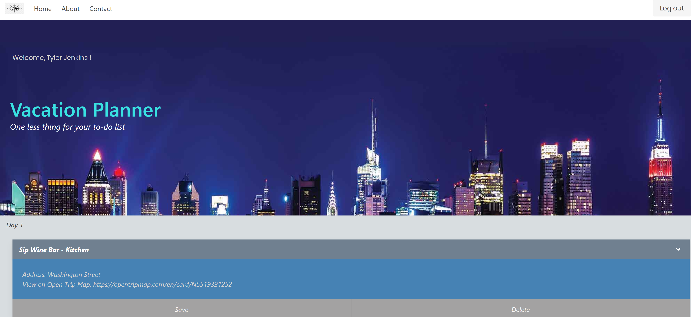

# Vacationer

Thank you for visiting our website!

# Purpose

The Vacationer app helps users come up with ideas for things to do and places to go when they are planning a vacation. We hooked into an API from which we pull location-specific data about restaurants, night life, music, hotels, and museums and put them into a daily planner format. Our goal is to simplify the process of figuring out what to do on your trip once you get there!

# Usage

Users will create an account and sign into Vacationer where they can enter a city name, length of stay, and select their interests then click the Submit button. They will get back information about each selected interest for each day of their trip. In a future version of Vacationer, users will have the ability to save those items to a printable itinerary, delete and auto-replace items that they don't want in their itinerary, and will get more information about each item back from the API.

# Screenshot of the app

# Technologies Used
  * MySql
  * Passportjs
  * Open Trip Map API
  * Sequelize
  * jQuery
  * Bulma

# Live site

https://jamesnicktyler.herokuapp.com/

# GitHub Repo

https://github.com/tdj03001/VacationPlanner

